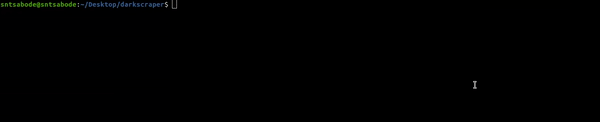
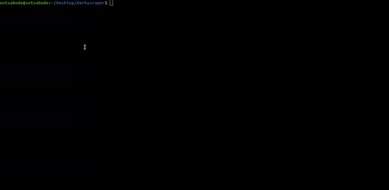

<tt><h1>Welcome to darkscraper</h1></tt>
<p>
  
  <a href="#" target="_blank">
    
  </a>
</p>

<tt>Darkscraper, a darkweb web crawler.</tt>



<tt><h2>Prerequisites</h2></tt>
<tt><em><strong>Use other versions at own risk.</em></strong></tt>

- <tt>Node >=16.13.0</tt>

- <tt>Npm >=8.1.0</tt>

- <tt>Yarn >=1.22.17</tt>

- <tt>Mongodb >=5.0.4</tt>

- <tt>Tor >=----</tt>

<tt><h2>Install</h2></tt>

```sh
git clone https://github.com/sntsabode/darkscraper
cd darkscraper
```

```sh
yarn install
yarn build
npm i -g
```

<tt><h2>Run Tests</h2></tt>

```sh
yarn run test
```

<tt><h2>Usage</h2></tt>

```sh
darkscraper <options>
```

<tt><h3>Options:</h3></tt>

- <tt>`-c` or `--crawler`: Boot your darkscraper instance.</tt>

> <tt>Running the `-c` flag will boot your darkscraper instance "picking up where it left off". ***It requires a running mongodb instance.***</tt>

- <tt>`-s` or `--server`: Boot a darkscraper api server.</tt>

> <tt>Running the `-s` flag will boot a darkscraper api server with the following endpoints:</tt>
>
> > <tt>`GET` `/fetch-dark-links`</tt>
> >
> > <tt><h4>Query Params:</h4></tt>
> > <tt>(`limit`: `number`): The maximum number of dark links to return.</tt>
> >
> > <tt><h4>Response:</h4></tt>
> >
> > ```json
> > {
> >   "links": [
> >     {
> >       "domain": "string",
> >       "paths": [
> >         {
> >           "path": "string",
> >           "title": "string",
> >           "blacklisted": "boolean",
> >           "crawled": "boolean"
> >         }
> >       ]
> >     }
> >   ],
> >   "error": "undefined | string"
> > }
> > ```
>
> > <tt>`GET` `/search-dark-links`</tt>
> >
> > <tt><h4>Query Params:</h4></tt>
> > <tt>(`search`: `string`): The search query.</tt>
> >
> > <tt>(`skip`: `number`): The number of dark links to skip (not search).</tt>
> >
> > <tt>(`limit`: `number`): The number of dark links to return</tt>
> >
> > <tt><h4>Response:</h4></tt>
> >
> > ```json
> > {
> >   "links": [
> >     {
> >       "domain": "string",
> >       "paths": [
> >         {
> >           "path": "string",
> >           "title": "string",
> >           "blacklisted": "boolean",
> >           "crawled": "boolean"
> >         }
> >       ]
> >     }
> >   ],
> >   "error": "undefined | string"
> > }
> > ```

- <tt>`-p` or `--purge`: Purge your local dark link database.</tt>

> <tt>Running the `-p` flag will delete all dark links in your local darkscraper dark link database.</tt>

- <tt>`-k` or `--configure`: Open a darkcrawler configure prompt menu.</tt>

> <tt>Running the `-k` flag will open a darkscraper configure prompt menu in which you can configure your darkscraper instance and your darkscraper api server:</tt>
>
> 

- <tt>`-l` or `--loglevel`: Set the processes' log level. Applies to both the server and crawler instance.</tt>

- <tt>`-y` or `--yes`: Run the process without asking any questions. (Will still ask on `--purge`).</tt>

<tt><h2>Author</h2></tt>

👤 <tt><strong>Sihle Masebuku</strong></tt>

- <tt>Github: [@sntsabode](https://github.com/sntsabode)</tt>

<tt><h2>Show your support</h2></tt>

<tt>Give a ⭐️ if this project helped you!</tt>

***

<tt>
<em>This README was generated with ❤️ by <a href="https://github.com/kefranabg/readme-md-generator">readme-md-generator</a></em></tt>
